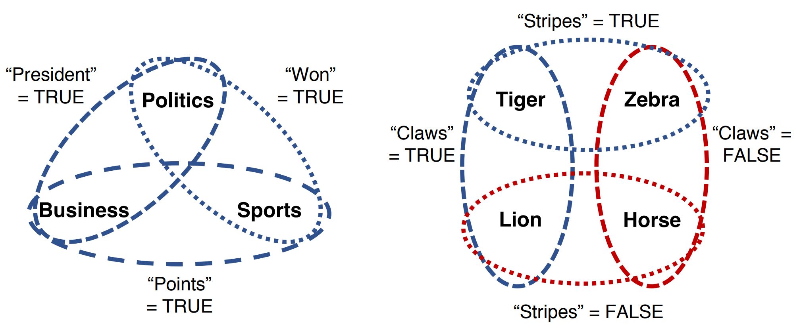
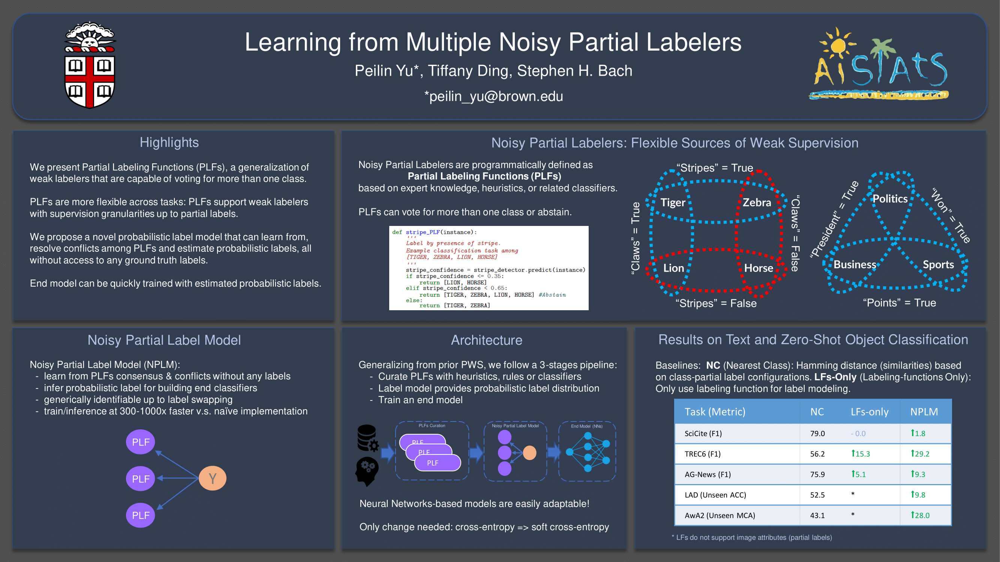

# NPLM

Welcome to NPLM (Noisy Partial Label Model), a programmatic weak supervision system that supports (partial) labeling
functions with supervision granuarity ranging from class to a set of classes.

> [!IMPORTANT]  
> This repository has been archived. To use nplm, please access it through the [labelmodels](https://github.com/BatsResearch/labelmodels).

Reference paper: [Learning from Multiple Noisy Partial Labelers](https://arxiv.org/pdf/2106.04530.pdf).

The experiments included in the paper can be found [Here](https://github.com/BatsResearch/yu-aistats22-code).




## Introduction

Programmatic weak supervision (PWS) creates models without hand-labeled training data by combining the outputs of noisy,
user-written rules and other heuristic labelers. Labelers are typically representated programmatically to output certain
candidate tasks. NPLM enables users to create partial labelers that output subsets of possible class labels would
greatly expand the expressivity of programmatic weaksupervision.

## Installation

```
git clone https://github.com/BatsResearch/nplm.git
cd nplm; pip install -r requirements.txt
pip install -e git+git://github.com/BatsResearch/labelmodels.git@master#egg=labelmodels
pip install .
```
or just run the fast install script:
```
git clone https://github.com/BatsResearch/nplm.git; cd nplm; sh install.sh
```

## Example Usage

We will update further tutorials and documentations shortly for real-world applications

## Example Usage 0 - Partial Label Model

```python
# Let votes be an m x n matrix where m is the number of data examples, n is the
# number of label sources, and each element is in the set {0, 1, ..., k_l}, where
# k_l is the number of label partitions for partial labeling functions PLF_{l}. If votes_{ij} is 0, 
# it means that partial label source j abstains from voting on example i.

# As an example, we create a random votes matrix for classification with
# 1000 examples and 3 label sources
import numpy as np
import torch

# label_partition is a table that specifies 0-indexed PLF's label partition configurations, for this brief example,
# we have 3 PLFs each separating the 3-class label space into two partitions. For 0-th PLF, it partitions the label space
# into \{1\} and \{2,3\}. Notice the class label is 1-indexed.
# The label_partition configures the label partitions mapping in format as {PLF's index: [partition_1, partition_2, ..., partition_{k_l}]}
simple_label_partition = {
    0: [[1], [2, 3]],
    1: [[2], [1, 3]],
    2: [[3], [1, 2]]
}
num_sources = len(simple_label_partition)
num_classes = 3
votes = np.random.randint(0, 1, size=(1000, 3))

device = 'cuda:0' if torch.cuda.is_available() else 'cpu'

# We now can create a Naive Bayes generative model to estimate the accuracies
# of these label sources
from nplm import PartialLabelModel

# We initialize the model by specifying that there are 2 classes (binary
# classification) and 5 label sources
model = PartialLabelModel(num_classes=num_classes,
                          label_partition=simple_label_partition,
                          preset_classbalance=None,
                          device=device)
# Next, we estimate the model's parameters
model.optimize(votes)
print(model.get_accuracies())

# We can obtain a posterior distribution over the true labels
labels = model.weak_label(votes)
```


<!-- ## Contact

Please feel free to reach out to the author at <first_name>_<last_name>@brown.edu regarding any questions! -->

## Citation

Please cite the following paper if you are using our tool. Thank you!

[Peilin Yu](https://www.yupeilin.com), [Tiffany Ding](https://tiffanyding.github.io/)
, [Stephen H. Bach](http://cs.brown.edu/people/sbach/). "Learning from Multiple Noisy Partial Labelers". Artificial
Intelligence and Statistics (AISTATS), 2022.

```
@inproceedings{yu2022nplm,
  title = {Learning from Multiple Noisy Partial Labelers}, 
  author = {Yu, Peilin and Ding, Tiffany and Bach, Stephen H.}, 
  booktitle = {Artificial Intelligence and Statistics (AISTATS)}, 
  year = 2022, 
}
```

